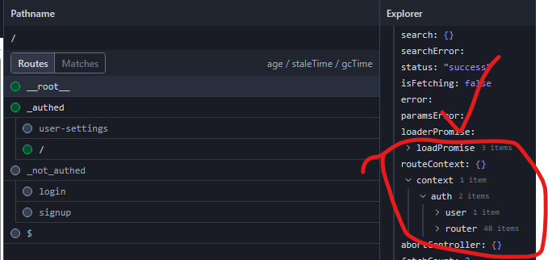

### Layout Route Contexts NOT being set on non-initial redirects in beforeLoad()

On non-initial loads, when a _layout route's beforeLoads() is triggered by <Link /> navigation, router.invalidate(), the route's contex returns `undefined`

Please run `vite dev` and use Auth Dev Controls to toggle auth state changes and observe the _LAYOUT/context returns `undefined`

Note: 
- the <outlet /> routes of the _layout returns the context correctly
- the root router's context has the returns context correctly

```tsx
export const Route = createFileRoute('/_not_authed')({
  beforeLoad: ({ context: { auth } }) => {
    //If the user is already authenticated, redirect them to the main dashboard
    if (auth.get()) {
      console.log('redirecting to /')
      throw redirect({ to: '/' })
    }
  },
  component: memo(Component),
})

function Component() {
  const context = Route.useRouteContext() //this returns undefined on non-initial redirect
  const rootContext = useRouteContext({ from: '__root__' }) //this seems to resolve
  console.log('_not_authed/context:', context, rootContext)

  return (
    <div className="bg-gray-300">
    ...
    </div>
  )
}
```

No context in _auth


__root__ has context



```
└── 📁routes
    └── 📁_authed 
        └── index.lazy.tsx
        └── user-settings.lazy.tsx
    └── _authed.tsx
    └── 📁_not_authed
        └── login.lazy.tsx
        └── signup.lazy.tsx
    └── _not_authed.tsx
    └── __root.tsx
```